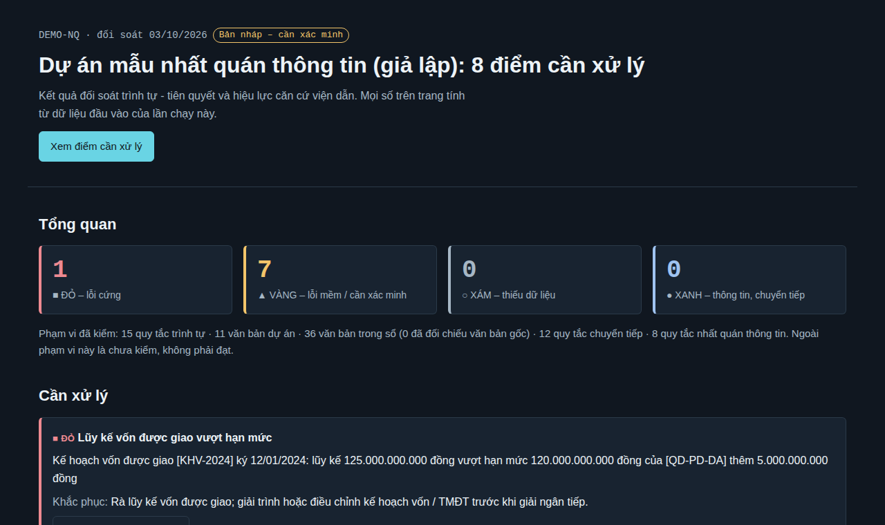
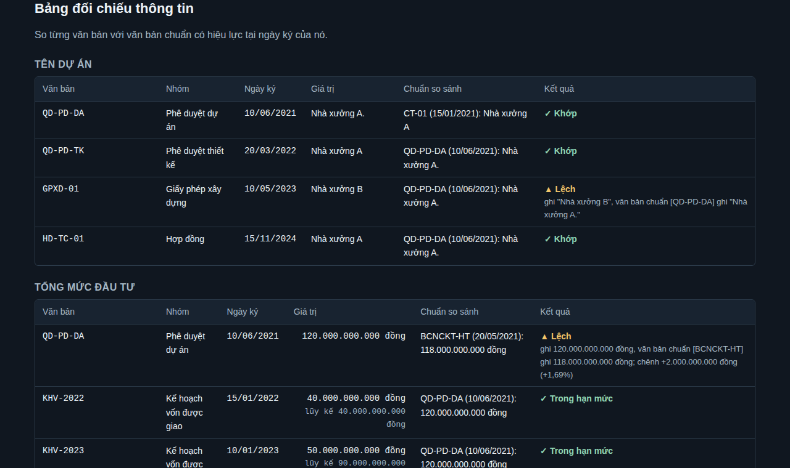
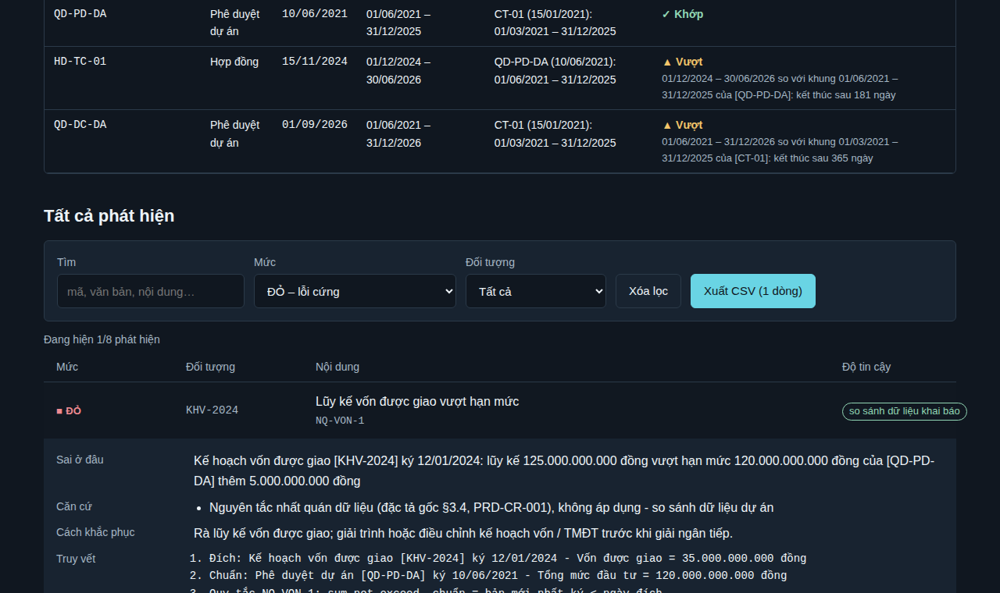

# Hướng dẫn sử dụng cross-check-engine · v0.3 · 03/10/2026

Tài liệu này hướng dẫn chức năng **đối soát nhất quán thông tin (UC-007)**. Các chức năng có trước
(UC-001…005) đang được hướng dẫn trong `README.md`; sẽ chuyển dần vào tài liệu này.

## 1. Giới thiệu
- **Dùng cho:** cán bộ Ban QLDA, pháp chế, kiểm toán nội bộ.
- **Yêu cầu máy:** Python 3.10+ và PyYAML. Mở báo cáo web bằng trình duyệt bất kỳ, không cần mạng.
- **Lưu ý:** kết quả là bản nháp hỗ trợ rà soát, không phải kết luận pháp lý.

## 2. Đối soát nhất quán thông tin giữa các văn bản (UC-007)

**Mục đích.** Phát hiện lệch tên dự án, TMĐT, quy mô, thời gian thực hiện, lũy kế vốn giữa các văn bản
dự án. Mỗi văn bản được so với **văn bản chuẩn có hiệu lực tại ngày ký của nó**, nên văn bản cũ không bị
báo oan khi dự án điều chỉnh về sau.

**Điều kiện trước.** Hồ sơ dự án (YAML) có mục `documents`; mỗi văn bản cần so có `nhom`, `ngay_ky`,
`thong_tin`. Văn bản điều chỉnh khai báo `thay_the`. Dự án vốn đầu tư công khai báo
`attributes.von_dau_tu_cong: true` để kiểm lũy kế vốn được giao.

### Bước 1 - Khai báo thông tin văn bản
```yaml
documents:
  - id: QD-PD-DA
    nhom: phe_duyet_du_an      # chu_truong | bcnckt_hoan_thien | phe_duyet_du_an | phe_duyet_thiet_ke
                               # | gpxd | hop_dong | ke_hoach_von | hoan_cong | khac
    ngay_ky: 2021-06-10
    thong_tin:
      ten_du_an: "Nhà xưởng A"
      tong_muc_dau_tu: 120000000000        # đồng, không dấu chấm
      dien_tich_san: 12500                 # m2
      chieu_cao: 24.5                      # m, dùng dấu chấm thập phân
      so_tang: 3
      thoi_gian_thuc_hien: {tu: 2021-06-01, den: 2025-12-31}
  - id: QD-DC-DA
    nhom: phe_duyet_du_an
    ngay_ky: 2026-09-01
    thay_the: [QD-PD-DA]                   # văn bản điều chỉnh: cùng nhóm, ký sau
    thong_tin: {tong_muc_dau_tu: 135000000000}   # chỉ cần ghi trường thay đổi
```
Chỉ ghi những trường **có trong văn bản đó**. Văn bản điều chỉnh không nhắc lại tên thì engine dùng tên ở
bản trước.

### Bước 2 - Chạy và mở báo cáo
```bash
python3 -m crosscheck ho_so.yaml --format html --out bao_cao.html
```
Mở `bao_cao.html`. Phần **Tổng quan** đếm cả phát hiện nhất quán; dòng phạm vi ghi số quy tắc nhất quán đã chạy.



### Bước 3 - Đọc Bảng đối chiếu thông tin
Mỗi trường một bảng: văn bản, nhóm, ngày ký, giá trị, **chuẩn so sánh** (văn bản chuẩn và ngày ký của
nó), kết quả. Kết quả luôn có chữ: `✓ Khớp`, `✓ Trong hạn mức`, `▲ Lệch`, `▲ Vượt`, `○ Thiếu chuẩn`, kèm
giải thích ngắn khi không khớp.



### Bước 4 - Lọc, xem truy vết, xuất CSV
Trong **Tất cả phát hiện**: chọn mức (ví dụ ĐỎ), bấm vào dòng để xem sai ở đâu, căn cứ, cách khắc phục, truy
vết (văn bản đích, văn bản chuẩn, quy tắc). Nhãn độ tin cậy **"so sánh dữ liệu khai báo"** nghĩa là phép so
đúng nhưng số liệu vẫn là số người nhập khai báo - đối chiếu bản gốc trước khi kết luận. **Xuất CSV** chỉ
xuất các dòng đang hiện.



**Kết quả mong đợi.** Mọi lệch giữa các văn bản có khai báo `thong_tin` đều hiện trong bảng và trong danh
sách phát hiện; hồ sơ không có `thong_tin` vẫn chạy như trước.

### Lỗi thường gặp
| Hiện tượng | Nguyên nhân | Cách xử lý |
|---|---|---|
| `○ Thiếu chuẩn` | Chưa có văn bản chuẩn ký trước văn bản này, hoặc văn bản chuẩn không có trường đó | Khai báo `thong_tin` cho văn bản chuẩn (ví dụ chủ trương, BCNCKT hoàn thiện) |
| `NQ-NHOM` (xám) | `nhom` viết sai | Dùng đúng một trong các mã nhóm ở Bước 1 |
| `NQ-PB` (vàng) | `thay_the` trỏ văn bản khác nhóm/không tồn tại/ký sau | Sửa `thay_the` |
| Không có NQ-VON-1 | Dự án không khai báo vốn đầu tư công | Đúng thiết kế: dự án vốn tư nhân không có kế hoạch vốn được giao |
| Mã thoát 2 | File quy tắc `--consistency` sai | Đọc thông báo lỗi; sửa `data/consistency_rules.yaml` |

## Phụ lục - Sửa quy tắc
`data/consistency_rules.yaml`: nhóm văn bản, trường, quy tắc (chuẩn → đích, kiểu so, dung sai `tolerance`
`{abs, pct}`, mức). Sửa xong chạy `python3 -m pytest -q` để bảo đảm không phá quy tắc khác.
