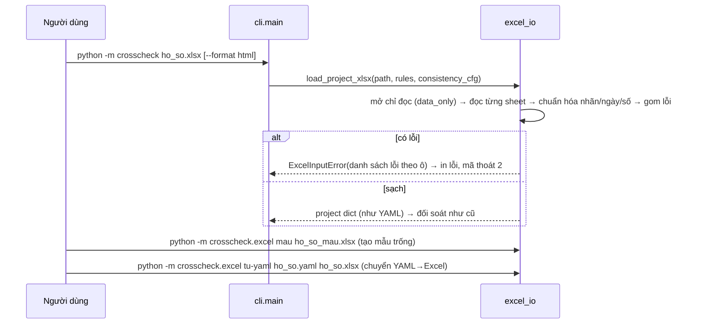

# Đặc tả CR-003 · v1.0 · 04/10/2026

## 1. File Excel mẫu (GATE 2) - 6 sheet
Dòng 1 mỗi sheet là tiêu đề cột (đóng băng); cột bắt buộc ghi `*`; cột có danh sách chọn ghi `▼`.

```
Sheet HuongDan   : cách điền, quy ước ngày/số, ý nghĩa mã; không đọc dữ liệu từ sheet này.

Sheet DuAn       │ A: Mục                          │ B: Giá trị
                 │ Mã dự án *                      │ DA-001
                 │ Tên dự án *                     │ Nhà xưởng A
                 │ Thuộc diện cấp GPXD ▼           │ Có / Không / (trống = chưa khai báo)
                 │ Thuộc diện thẩm tra thiết kế ▼  │ Có / Không
                 │ Thuộc diện chứng nhận an toàn ▼ │ Có / Không
                 │ Vốn đầu tư công ▼               │ Có / Không

Sheet TrinhTu    │ Bước * ▼ (nhãn trong procedure_rules) │ Trạng thái * ▼ │ Ngày bắt đầu │ Ngày hoàn thành │ Chứng cứ │ Căn cứ không áp dụng
                 │ Phê duyệt dự án, quyết định đầu tư…   │ Hoàn thành     │              │ 10/06/2021      │ QD-PD-DA │
                   Trạng thái: Chưa bắt đầu | Đang thực hiện | Hoàn thành | Không áp dụng

Sheet HopDong    │ Mã hợp đồng * │ Ngày ký * │

Sheet VanBan     │ Mã văn bản * │ Loại văn bản │ Nhóm ▼ │ Ngày ký │ Ngày nộp │ Ngày phát hành HSMT │ Mã hợp đồng
                 │ Thay thế (mã, cách nhau dấu phẩy) │ Tên dự án │ TMĐT (đồng) │ Vốn được giao (đồng)
                 │ Diện tích sàn (m²) │ Chiều cao (m) │ Số tầng │ Thời gian thực hiện từ │ … đến
                   Nhóm: nhãn trong consistency_rules (Chủ trương đầu tư, Phê duyệt dự án, …)

Sheet CanCu      │ Mã văn bản * │ Văn bản viện dẫn * │ Điều/khoản
                 │ QD-PD-DA     │ Nghị định 15/2021/NĐ-CP │
                 │ CV-MIEN-GP   │ 135/2025/QH15           │ Điều 43 khoản 2
                   (một dòng một căn cứ - thay cho danh sách can_cu trong YAML)
```
Danh sách chọn lấy từ chính file quy tắc đang dùng (bước, nhóm văn bản) nên luôn khớp engine.

## 2. Thông báo lỗi nhập liệu (GATE 2)
```
Lỗi: file ho_so.xlsx có 3 lỗi nhập liệu, chưa chạy đối soát.
  TrinhTu!C4  Trạng thái "xong" không hợp lệ. Chọn: Chưa bắt đầu, Đang thực hiện, Hoàn thành, Không áp dụng.
  VanBan!D7   Ngày ký "31/02/2023" không phải ngày hợp lệ. Dùng dd/mm/yyyy.
  CanCu!A12   Mã văn bản "QD-PD-DAA" không có trong sheet VanBan.
```

## 3. Ánh xạ sang hồ sơ (không đổi engine)
| Excel | Hồ sơ |
|---|---|
| DuAn | `project{id,name}`, `attributes{requires_permit, requires_design_verification, requires_safety_certification, von_dau_tu_cong}` |
| TrinhTu | `steps{step_id: {status, start_date, date, evidence, na_basis}}` |
| HopDong | `contracts{ma: {ngay_ky}}` |
| VanBan | `documents[{id, loai, nhom, ngay_ky, ngay_nop, ngay_phat_hanh_hsmt, hop_dong, thay_the[], thong_tin{…}}]` |
| CanCu | `documents[].can_cu[]` (chuỗi, hoặc `{van_ban, dieu_khoan}` khi có điều/khoản) |

## 4. Kiểm lỗi (GATE 3)
Thiếu sheet bắt buộc (DuAn, VanBan; TrinhTu/HopDong/CanCu được để trống) · thiếu cột bắt buộc · ô bắt buộc trống ·
nhãn/mã không thuộc danh sách · ngày sai · số sai · mã trùng (bước, hợp đồng, văn bản) · tham chiếu tới mã không
có (CanCu→VanBan, VanBan.Mã HĐ→HopDong, Thay thế→VanBan) · ô công thức không có giá trị · file > 20 MB hoặc
không phải xlsx. Dòng trống hoàn toàn bị bỏ qua. Lỗi nghiệp vụ (ngày sai thứ tự, lệch thông tin) **không** kiểm
ở đây - đó là việc của engine đối soát.

## 5. Luồng (GATE 3)

Hai lệnh tạo file không ghi đè file đã có (mã thoát 2). Phụ thuộc mới `openpyxl` chỉ cần khi dùng Excel.

## 6. User stories (UC-008)
- **US-008a Đọc Excel.** Given file điền đúng → When chạy `crosscheck ho_so.xlsx` → Then báo cáo như từ YAML.
- **US-008b Lỗi theo ô.** Given 3 ô sai → Then in đủ 3 lỗi dạng `Sheet!Ô`, kèm cách sửa; không ra báo cáo; mã 2.
- **US-008c Nhãn hoặc mã.** Given ô Trạng thái ghi "Hoàn thành" hoặc "completed" → Then cùng kết quả.
- **US-008d Ngày, số kiểu Việt Nam.** Given "10/06/2021", "120.000.000.000", "24,5" dạng chữ → Then đọc đúng.
- **US-008e Tạo mẫu.** Given lệnh `mau` → Then file có 6 sheet, tiêu đề cột, danh sách chọn khớp file quy tắc.
- **US-008f Chuyển YAML→Excel.** Given 3 hồ sơ mẫu → When chuyển và đọc lại → Then Markdown y hệt bản từ YAML.

## 7. Nghiệm thu
TC-XL (pytest): mỗi US ít nhất 1 ca đúng + 1 ca lỗi; khứ hồi 3 hồ sơ mẫu; file không phải xlsx; ô công thức.
Mẫu được kiểm bằng openpyxl và mở/chuyển đổi bằng LibreOffice (có sẵn trong môi trường build). Môi trường build
không có Microsoft Excel - mở thử bằng Excel thật thuộc GATE 4 (UAT).
